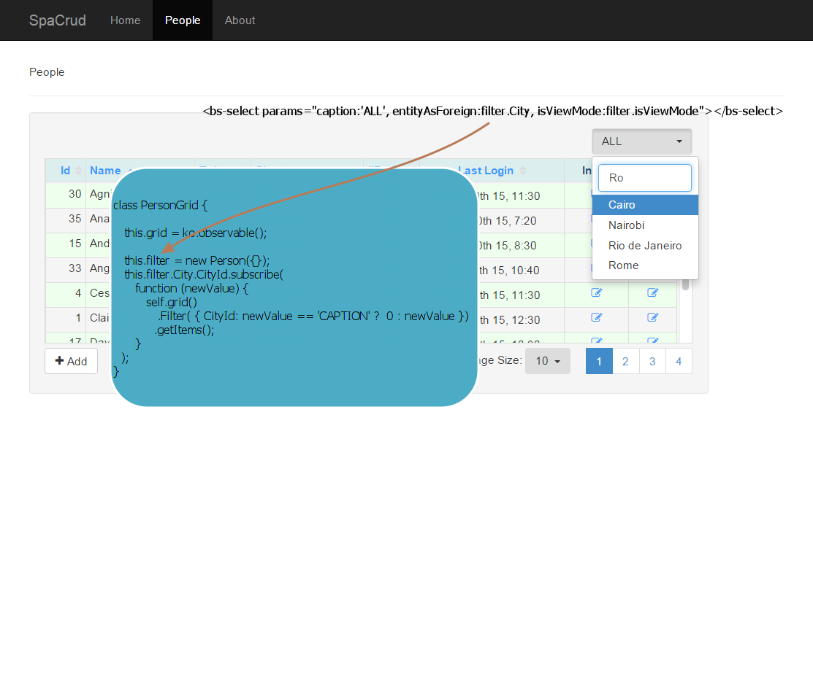
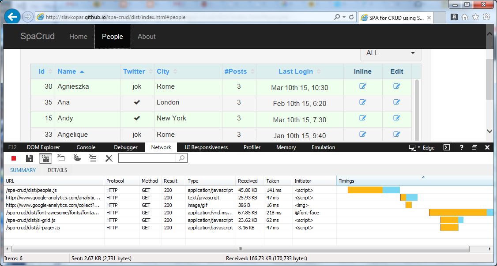

#Knockout Component "SLGrid"
Single Page Application for CRUD using "SLGrid"

Contributors:

* <a href="mailto:slavko.parezanin@gmail.com" target="_blank">Slavko Parezanin</a>

License: [MIT](http://www.opensource.org/licenses/mit-license.php)

## Introduction

SLGrid is Knockout Component with standard grid features: 
* paging 
* sorting
* filtering 
* inline editing 
* each cell can contain another Knockout Component like DateTimePicker, Drop-Down, and any other reusable component
* ...

I will present usage of SLGrid component in Single Page Application environment for CRUD operations.
These grid features are very useful for Admin part of any site with many different tables and relations.
Actually, this is attempt to finaly define set of actions needed for Create, Read, Update and Delete some entity.

I decided to follow Steve’s Sanderson example, using 'yeoman' to scaffold out an SPA with Knockout, CrossroadsJS and RequireJS.
CrossroadsJS implements hashtag routing, and RequireJS handles module loading and dependencies.
I was following the presentation of [Steve Sanderson - Architecting large Single Page Applications with Knockout](https://vimeo.com/97519516)


[Generate a starting point for a Knockout application](https://github.com/SteveSanderson/generator-ko)

Getting the Knockout project going was surprisingly easy.
Here are the commands to install 'Yeoman' and scaffold the project:

   npm install -g yo
   npm install -g generator-ko
   yo ko

That gives us a simple project structure with routing and two initial views (Home and About pages).
Adding additional views and components can be done manually, but Yeoman also provides a shortcut command:

   yo ko:component <name>

#### Links
[Try it](http://slavkopar.github.io/spa-crud/dist/index.html)

## Background

SLGrid is client Component grid, rather than grid for ASP.NET 5.1, MVC 4.2, PHP 7.8 ...
That way we avoid generation of HTML markup and JavaScript code at server, escaping already escaped, and stealing any possible developer creativity with different kind of templates.

####The key technologies used in this demo are:
* Knockout Components, clean way of organizing UI code into self-contained, reusable chunks
* Reguirejs, for Asynchronous Module Definition (AMD)
* gulpjs, The streaming build system 
* babel, JavaScript ES2015 transpiler
* JavaScript inheritance pattern
* jQuery for managing Ajax calls to a services
* Bootstrap for stylization of HTML markup

##Getting Started
For CRUD operations of an Entity we need to define 3  JavaScript classes, acutally 3 AMD modules.
In example for entity 'People' we define:
* *Person*, inherits *SLEntity*, definition of properties with default value and validation rules.
* *PersonDB*, inherits *SLEntityDB*, database adapter, different for different types of databases, performs ajax calls to server
* *PersonGrid*, uses *SLGrid* and *SLPager*, keeping list of entites, performing grid operations like paging, sorting, inline editing ... 
  It defines properties of Person Entity which will be presented in tabular view. 
  It generates Row and RowEdit templates based on definition of columns.

Actually we can generate these classes using 'yeoman', reading from database definition and respecting all relations from database like: one to many, many to many ...


```javascript
// Person
class Person extends SLEntity {
    constructor(data) {
        super(data);

        this.PersonId = ko.observable(data.PersonId || 0)
        this.Name = ko.observable(data.Name || "").extend({ required: true, minLength: 2 })
        this.IsOnTwitter = ko.observable(data.IsOnTwitter === undefined ? false : data.IsOnTwitter)
        this.TwitterName = ko.observable(data.TwitterName || "")
        this.City = new CityAsForeign(data.City || {})
        this.NumOfPosts = ko.observable(data.NumOfPosts || 0)
        this.LastLogin = ko.observable(data.LastLogin ? new Date(data.LastLogin) : new Date())
    }
}
```
<a href="https://github.com/SlavkoPar/spa-crud/blob/master/src/models/person/person.js" target="_blank">Person source code</a>


```javascript
// PersonDB

class PersonDB extends SLEntityDB {
    constructor(data) {
        super(data);
    }
}

PersonDB.prototype.Url = {
    "get" :     "api/people",
    "getById":  "api/people/getById",
    "add":    "api/people/post",
    "update":   "api/people/put"
}
```
<a href="https://github.com/SlavkoPar/spa-crud/blob/master/src/models/person/person-db.js" target="_blank">PersonDB source code</a>


```javascript
// PersonGrid

class PersonGrid {

  constructor(params) {
    var self = this;

    this.Person = Person;
    this.pageSize = ko.observable(params.pageSize);

    this.pager = ko.observable();
    this.grid = ko.observable();
    this.grid.subscribe(function (grid) {
        // now we have the grid component instantiated
    })

    this.columns = [
        { fieldName: 'PersonId', header: 'Id', width: '50px', align: 'right' },
        { fieldName: 'Name', header: 'Name', width: 'auto' }, 
        { fieldName: 'IsOnTwitter', header: 'Twitter', width: '70px', align: 'center', presentation: 'bindingHandlerCheckbox' },
        { fieldName: 'City', header: 'City', width: '140px', 
					markup: "<bs-select params='entityAsForeign:City, isViewMode:isViewMode' />" },
        { fieldName: 'NumOfPosts', header: '#Posts', width: '70px', align: 'center' },
        { fieldName: 'LastLogin', header: 'Last Login', width: '180px', align: 'center', 
					markup: "<sl-date-picker params='date:LastLogin, isViewMode:isViewMode'/>" },
        { fieldName: '', header: 'Inline', width: '80px', presentation: 'bindingHandlerEditInline', sortable: false, align: 'center' },
        { fieldName: '', header: 'Edit', width: '60px', presentation: 'bindingHandlerEdit', sortable: false, align: 'center' }
    ];

    this.filter = new Person({});
    this.filter.City.CityId.subscribe(function (newValue) {
        self.grid().Filter({ CityId: newValue == 'CAPTION' ? 0 : newValue });
        self.grid().getItems();
    });

    this.pageSize.subscribe(function (newValue) {
        self.grid().getItems(1 /*page*/, newValue /*pageSize*/);
    });

    // Add
    this.addNew = function () {
        location.hash = '#person-add';
    }

    // Edit
    this.editEntity = function (vm, e) {
        var personDB = Person.prototype.entityDB;
        personDB.getById(vm.PersonId(), function (data) {
            window.personData = data;
            location.hash = '#person-edit/' + vm.PersonId();
        })
    }

  }
}
```
<a href="https://github.com/SlavkoPar/spa-crud/blob/master/src/components/person-grid/person-grid.js" target="_blank">PersonGrid source code</a>


##How child Knockout components communicate 
Components are a powerful, clean way of organizing your UI code into self-contained, reusable chunks.
Components communicate through 'params' object that will be passed on to the component. 
Typically this is a key-value object containing multiple parameters, and is typically received by the component’s viewmodel constructor.

**This picture presents the way Filter (drop-down) and SLGrid communicate**:



####How child Knockout components SLGrid and SLPager get connected
<a href="http://jsfiddle.net/SlavkoPar/066kzxjz/" target="_blank">How child knockout components SLGrid and SLPager get connected</a>
       

## Base javascript classes do the job:
* <a href="https://github.com/SlavkoPar/spa-crud/blob/master/src/app/sl-grid/sl-entity.js" target="_blank">SLEntity source code</a>
* <a href="https://github.com/SlavkoPar/spa-crud/blob/master/src/app/sl-grid/sl-entity-db.js" target="_blank">SLEntityDB source code</a>
* <a href="https://github.com/SlavkoPar/spa-crud/blob/master/src/app/sl-grid/sl-dropdown-db.js" target="_blank">SLDropdownDB source code</a>


## Mocker
The mockjax plugin is a development and testing tool for intercepting and simulating ajax requests made with jQuery with a minimal impact on changes to production code. For the purposes of this sample app, server is actually a mocked server,  which enables us to have live demo, without hosting an actual server anywhere.


##Bundling and Minifying 
**Dynamic loading of components**:

We set components we need for *People* into the same bundle

	bundles: {
		...
		'people': [	'components/person-grid/person-grid', 
					'pages/people/people', 
					'pages/people/add/person-add', 
					'pages/people/edit/person-edit']
	}

That way we get dynamic loading of 'people.js', only when user clicks on 'People' in top bar menu.




## Yeoman generator

**The plan is to make *generator-sl-grid* tool** using 
http://yeoman.io/authoring/

Generator would read any Database definition: tables, columns and relations, generating pages and components needed for CRUD operations for some table (Entity).
That way we could generate complete starting point of some Admin site with many tables. 
With well designed components and JavaScript classes, it would be much more easier for developers to customize templates and implement additional logic.

For example reading definition of table City we could generate City class 

```javascript
class City extends SLentity 
{
    constructor(data) {
        super(data);

        this.CityId = ko.observable(data.CityId).extend({ defaultValue: 102, required: true, minLength: 2 })
        this.Name = ko.observable(data.Name)
		
        this.CountryId = ko.observable(data.CountryId).extend({ foreignKey: Country })
    }

}
```

Also 'yeoman' generates others file needed for CRUD operations for *City*.

* CityController at server for operations  getItems, getById, Add, Update and Remove
* CityDto - data transfer object between client and server  

**components/**

 	city-grid/

		city-grid.js

		city-grid.html

**models/**

	city/

		city.js
		city-db.js

 **pages/**
	
	people/

		add/

			city-add.js

			city-add.html

		edit/

			city-edit.js

			city-edit.html

		cities.js

		cities.html


